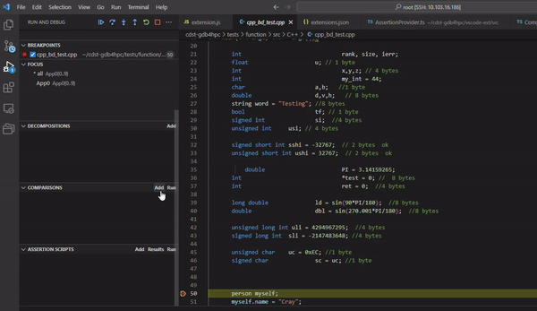

# GDB4HPC EXTENSION

A VSCode extension that provides support for debugging multi-process applications with gdb4hpc.   Gdb4hpc must be installed on the target machine; it is available as part of the Cray Programming Environment.

The plugin is based on the gdb vscode plugin, with all the familiar next, step and continue buttons, variable values, and backtraces, but adds additional panels for:

- focus : switch between working with every process at once and controlling subsets
- comparisons : compare data values between individual ranks or separate applications.
- assertion scripts: allow you to automatcially check for data consistency like a conditional breakpoint.
- decomposition: lets you treat data distributed across multiple ranks as a single array.

The other key feature of gdb4hpc is the _process set notation_ which aggregates identical results.   Thus the value of a variable may be printed as:

```
$a{0..800,802..999} 100
$a{801} 101
```

To quickly highlight that the process in rank 801 is not behaving like the rest.

The current online documentation for gdb4hpc and this vscode plugin are available here:

https://cpe.ext.hpe.com/docs/latest/debugging-tools/gdb4hpc/guides/vscode-plugin.html

> Note:
> Version 2.0.0 of this plugin requires at least gdb4hpc version 4.16.5
> gdb4hpc version 4.16.0-4.16.4 will only work with plugin version 1.0.0
> 
> Future version will use a more rational scheme for managing the dependency.

## Getting Started

A launch.json file is needed. If it does not exist, create a launch.json file and copy the template below and modify as necessary.
```
{
    "version": "1.1.1",
    "configurations": [
        {
            "type": "gdb4hpc",
            "request": "launch",
            "name": "GDB4HPC",
            "setupCommands": ["module load gdb4hpc"], 
            "connConfig": {
                "host": "",
                "port": "",
                "username":"",
                "privateKey": ""
            },
            "apps": [
                {
                    "procset": "",
                    "program": "",
                    "args": ""
                }
            ],
            "cwd": "", 
            "env": {

            },
        }
    ]
}

```

- setupCommands = any commands to send to terminal before gdb4hpc is launched including pointing to the gdb4hpc executable. 

- connConfig = setup a remote connection for GDB4HPC. For a remote connection, provide a host, port, username, and private key. Make sure the machine to connect to is accessible using a privatekey for a secure connection. For a local connection, leave host empty. 

- apps = the list of applications to be launched:
Multiple applications can be launched using the launch config by adding information for another app to the list
```
"apps": [
    {
        "procset": "",
        "program": "",
        "args": ""
    },
    {
        "procset": "",
        "program": "",
        "args": ""
    }
]
```
- procset = name and ranks for launch command i.e. "App0{10}"

- program = path of program to debug

- args = arg flags for launch command i.e "--gpu --non-mpi"

- cwd = current working directory

- env = list of any env varibales to apply. This list is only used for a local connection. For a remote GDB4HPC connection, add export statements to the setupCommands or add them manually if setupCommands are not used.
 List environment variables in this format:
```
{
    "GDB4HPC_DEBUG_INTERPRETER": "1",
    "CRAY_DBG_LOG_DIR": "."
}
```

----------


## Launching a debug job

Open the Run and Debug panel on the left. Choose GDB4HPC in the Dropdown on the top of the panel. If GDB4HPC does not show up as an option, the extension is not installed properly or the launch.json file is not configured correctly.


Press the green play button on the left of "GDB4HPC" to launch the debugger session. Once launched, this will be replaced by the pause, step, continue, next, and stop buttons.


## Consoles
Different terminals are available on the bottom.

### Debug Console
The Debug Console is the output console for GDB4HPC. Any information and warnings will show up here. If setupCommands is empty in the launch.json file, this Debug Console will be interactive until the "gdb4hpc" command is given which will then launch gdb4hpc. On a remote gdb4hpc connection, the Debug Console will display the remote machine information once it sets up the remote connection before the setupCommands or interactive user input can be processed.

### Output
There is a drop down on the right to choose the Output Channel to view.
**Program Output** will automatically become displayed whenever the application running produces output.
**Error Log** will log all errors while the session is running. Errors also get displayed in a popup as they appear.

## Source Code Display
The screen displays the source code automatically when launched. The current line in the file will be highlighted for the first application and first rank by default. To change this, you can set the desired Application and Rank in the display filter. You can interact with the source code to set breakpoints and get current variable values by hovering. 

## Left Side Panel
The left side panel provides extra ways to interact with the gui. 
Each section of this panel is described below.

### Variables
Local variables and their values will appear here. If the value is different for different ranks it will show up as a separate field here.  

### Watch
In this section, add a custom variable or expression to track.

### Call Stack
Stack information is displayed including the threads and their current status. The current thread is marked with a **selected** label.

### Breakpoints
To set a breakpoint, you can click on the line number that you would like to break on in the source code panel and you can delete it by pressing on the line number again. 

After a breakpoint is created, it will be displayed under the **breakpoint** section of on the left side.
You can enable, disable, and delete each breakpoint here.

  

### Focus
This section allows you to see the lists of pe sets for GDB4HPC and change the focus used by GDB4HPC. The pe set in focus is marked as with *. Choose a different pe set to focus on by pressing the **radio** button next to it or adding it to the list by providing a name for it and its procset. If a name is omitted, the pe set will be temporary and will be removed from the list once it is no longer in focus.

  

### Display Filter
This section allows the user to filter the information on the display. It does not change the focus in GDB4HPC. The user can add application and rank inforamation they want to be displayed to find information quicker. The user can set the application for the source code to highlight and focus on. 

### Decompositions
To create a decomposition, click the add button in the Decomposition section. This will make a popup appear on the top of the screen. 
In the pop-up enter a name for the decomposition (i.e. $decomp1) or a full decomposition command (i.e. $decomp1 10/2). If you enter in a command, the decomposition will be added to the decomposition section.
If you enter just a name for the decomposition, a new popup will appear to add a decomposition subcommand. This popup will continue to reappear until it is dismissed. When the popup is dissmised, the decomposition will be saved and shown int the decomposition section. 

  

### Compare
To add a comparison, click on the add button in the comparison section. This will make a popup appear on the top of the screen where a comparison is inputted. Press enter to dismiss the popup and save the comparison.
 
When you click the **Compare** button, all of the comparisons in the list that are enabled will be run. Toggle a comparison off if you do not wish to run it.  

  

### Assertion Scripts
To add an assertion, click the add button in the Assertion section. This will make a popup appear on the top of the screen. Follow the instructions on creating the assertion script in the popup. 
Once a name and stop on error have been set, assertions can continue to be added until the popup is dismissed. Dismissing the popup will save the assertion script.

Choose an assertion script from the list to run by selecting its radio button. Then click the **Run** button. Once it is done running, click on the **Results** button.
This will update the display with the results of the run.  


## Further Reading

Gdb4hpc has a more functionality available via the command line interface.  See the online guides here:

https://cpe.ext.hpe.com/docs/latest/debugging-tools/index.html#gdb4hpc


